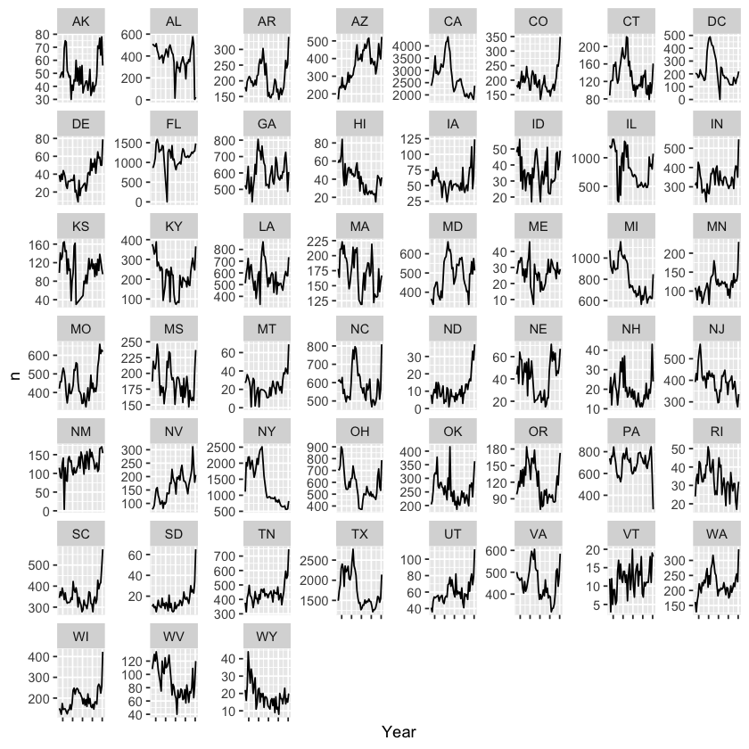
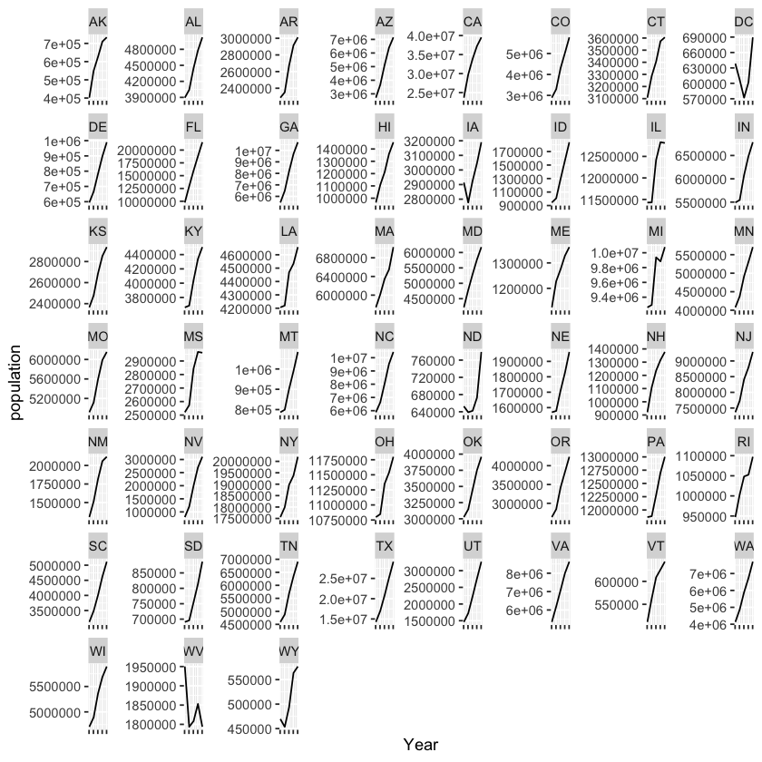
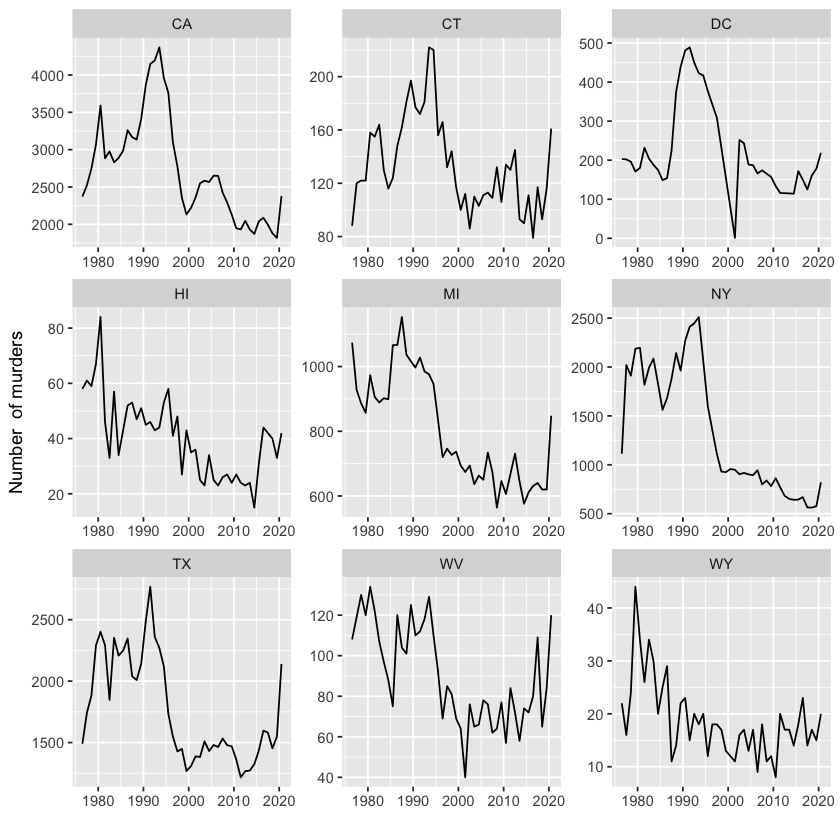
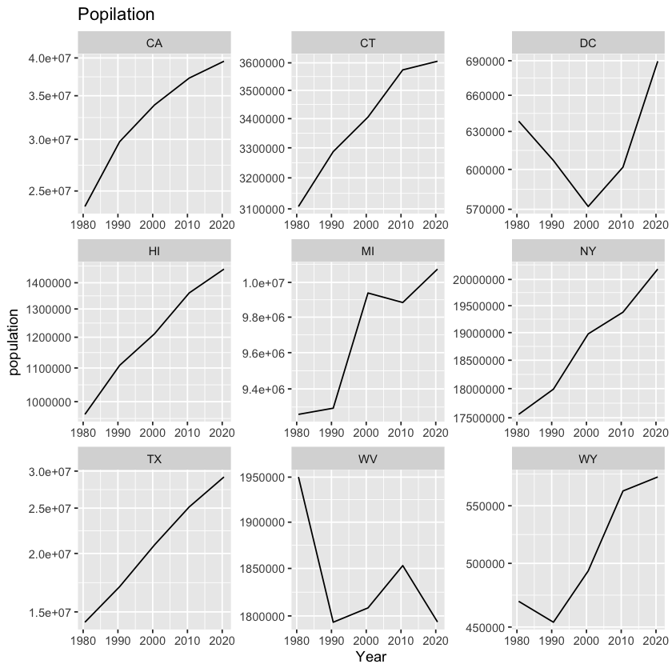
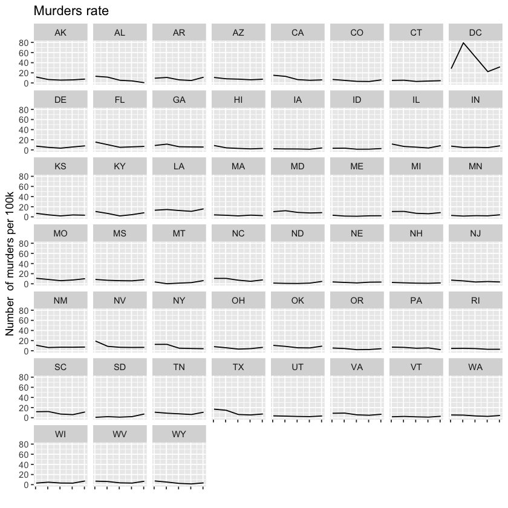
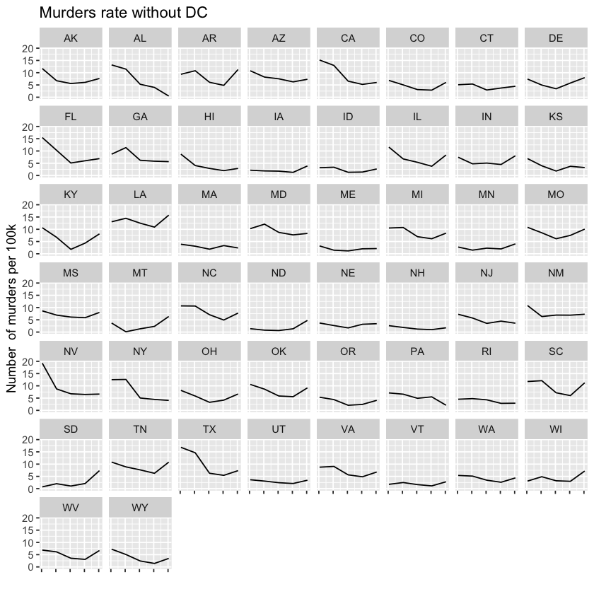
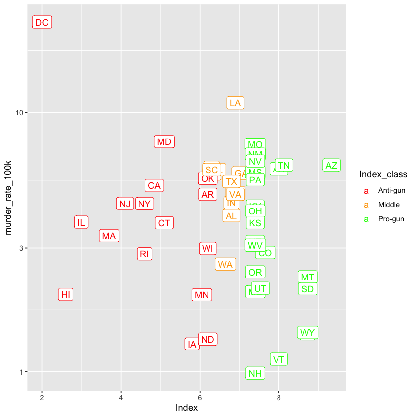

```R
#In this project I'm going to explore murders data in the US. I want to answer  5 questions about it:
#1) Which states were doing better in decreasing murder numbers?
#2) When did murders hit their maximum ?
#3) Which states were doing better in decreasing level of murders (murders/population), and were these states the same as in the fist question
#4) What states were having the lowest murder rate for a long time?
#5) Does it correlate with the GFI(Gun Friendly Index)?
```


```R

```


```R

```


```R
install.packages(c("readr", "readxl", "dplyr", "ggrepel","data.table", "timechange", "haven", "tidyr", "stringr","scales", "lubridate", "ggplot2", "scales", "janitor", "devtools"))

library(readr)
library(dplyr)
library(data.table)
library(timechange)
library(stringr)
library(lubridate)
library(ggplot2)
library(scales)
library(devtools)
install_github("ProcessMiner/nlcor")
library(nlcor)
library(haven)
library(readxl)
library(tidyr)
library(scales)
library(ggrepel)
```

    
    The downloaded binary packages are in
    	/var/folders/dz/2djfbpx56bl18bsf7qtl8x840000gn/T//Rtmp9iKHQI/downloaded_packages


    
    Attaching package: ‘dplyr’
    
    
    The following objects are masked from ‘package:stats’:
    
        filter, lag
    
    
    The following objects are masked from ‘package:base’:
    
        intersect, setdiff, setequal, union
    
    
    
    Attaching package: ‘data.table’
    
    
    The following objects are masked from ‘package:dplyr’:
    
        between, first, last
    
    
    
    Attaching package: ‘lubridate’
    
    
    The following objects are masked from ‘package:data.table’:
    
        hour, isoweek, mday, minute, month, quarter, second, wday, week,
        yday, year
    
    
    The following objects are masked from ‘package:base’:
    
        date, intersect, setdiff, union
    
    
    
    Attaching package: ‘scales’
    
    
    The following object is masked from ‘package:readr’:
    
        col_factor
    
    
    Loading required package: usethis
    
    Skipping install of 'nlcor' from a github remote, the SHA1 (92d4aa3c) has not changed since last install.
      Use `force = TRUE` to force installation
    


```R

```


```R

```


```R
crime_data_start <- read_sav("/Users/daniel/Downloads/SHR76_20.sav")
```


```R
crime_data_start$State  <- as.factor(crime_data_start$State)


```


```R
str(crime_data_start)
```

    tibble [827,219 × 31] (S3: tbl_df/tbl/data.frame)
     $ ID          : chr [1:827219] "197609001AL00400" "197701001AL00400" "197703001AL00400" "197703001AL00401" ...
      ..- attr(*, "label")= chr "ID (MAP GENERATED)"
      ..- attr(*, "format.spss")= chr "A16"
      ..- attr(*, "display_width")= int 20
     $ CNTYFIPS    : chr+lbl [1:827219] 01001, 01001, 01001, 01001, 01001, 01001, 01001, 01...
       ..@ label        : chr "COUNTY NAME"
       ..@ format.spss  : chr "A15"
       ..@ display_width: int 19
       ..@ labels       : Named chr [1:3202] "ZZ000" "02100" "51600" "51700" ...
       .. ..- attr(*, "names")= chr [1:3202] "Foreign Resident" "Haines, AK" "Fairfax, VA" "Newport News, VA" ...
     $ Ori         : chr [1:827219] "AL00400" "AL00400" "AL00400" "AL00401" ...
      ..- attr(*, "label")= chr "ORI CODE"
      ..- attr(*, "format.spss")= chr "A7"
     $ State       : Factor w/ 52 levels "AK","AL","AR",..: 2 2 2 2 2 2 2 2 2 2 ...
     $ Agency      : chr [1:827219] "Autauga County" "Autauga County" "Autauga County" "Prattville" ...
      ..- attr(*, "label")= chr "AGENCY NAME"
      ..- attr(*, "format.spss")= chr "A450"
      ..- attr(*, "display_width")= int 27
     $ Agentype    : dbl+lbl [1:827219] 1, 1, 1, 3, 1, 1, 1, 1, 1, 3, 1, 1, 3, 3, 3, 3, 3, ...
       ..@ label        : chr "TYPE OF AGENCY"
       ..@ format.spss  : chr "F1.0"
       ..@ display_width: int 13
       ..@ labels       : Named num [1:8] 1 2 3 5 6 7 8 9
       .. ..- attr(*, "names")= chr [1:8] "Sheriff" "County police" "Municipal police" "Primary state LE" ...
     $ Source      : dbl+lbl [1:827219] 1, 1, 1, 1, 1, 1, 1, 1, 1, 1, 1, 1, 1, 1, 1, 1, 1, ...
       ..@ label        : chr "DATA SOURCE: FBI OR MAP FOIA"
       ..@ format.spss  : chr "F1.0"
       ..@ display_width: int 5
       ..@ labels       : Named num [1:2] 0 1
       .. ..- attr(*, "names")= chr [1:2] "MAP" "FBI"
     $ Solved      : dbl+lbl [1:827219] 0, 1, 1, 1, 1, 1, 1, 1, 0, 1, 1, 1, 1, 1, 1, 1, 1, ...
       ..@ label      : chr "WAS OFFENDER IDENTIFIED"
       ..@ format.spss: chr "F1.0"
       ..@ labels     : Named num [1:2] 0 1
       .. ..- attr(*, "names")= chr [1:2] "No" "Yes"
     $ Year        : num [1:827219] 1976 1977 1977 1977 1977 ...
      ..- attr(*, "label")= chr "YEAR"
      ..- attr(*, "format.spss")= chr "F4.0"
      ..- attr(*, "display_width")= int 6
     $ StateName   : chr [1:827219] "" "" "" "" ...
      ..- attr(*, "label")= chr "STATE NAME"
      ..- attr(*, "format.spss")= chr "A6"
      ..- attr(*, "display_width")= int 16
     $ Month       : dbl+lbl [1:827219]  9,  1,  3,  3,  8, 10,  5, 12,  2, 12,  8,  9,  1,...
       ..@ label      : chr "MONTH OF OFFENSE"
       ..@ format.spss: chr "F2.0"
       ..@ labels     : Named num [1:12] 1 2 3 4 5 6 7 8 9 10 ...
       .. ..- attr(*, "names")= chr [1:12] "January" "February" "March" "April" ...
     $ Incident    : num [1:827219] 1 1 1 1 1 1 1 1 1 1 ...
      ..- attr(*, "label")= chr "INCIDENT NUMBER"
      ..- attr(*, "format.spss")= chr "F3.0"
      ..- attr(*, "display_width")= int 6
     $ ActionType  : dbl+lbl [1:827219] 0, 0, 0, 0, 0, 0, 0, 0, 0, 0, 0, 0, 0, 0, 0, 0, 1, ...
       ..@ label        : chr "TYPE OF ACTION"
       ..@ format.spss  : chr "F1.0"
       ..@ display_width: int 12
       ..@ labels       : Named num [1:2] 0 1
       .. ..- attr(*, "names")= chr [1:2] "Normal update" "Adjustment"
     $ Homicide    : chr+lbl [1:827219] A, A, A, A, A, A, A, A, A, A, A, A, A, A, A, A, A, ...
       ..@ label        : chr "TYPE OF OFFENSE:HOMICIDE"
       ..@ format.spss  : chr "A1"
       ..@ display_width: int 18
       ..@ labels       : Named chr [1:2] "A" "B"
       .. ..- attr(*, "names")= chr [1:2] "Murder and non-negligent manslaughter" "Manslaughter by negligence"
     $ Situation   : chr+lbl [1:827219] B, A, C, A, A, A, C, A, B, A, A, A, A, A, A, A, A, ...
       ..@ label        : chr "SITUATION"
       ..@ format.spss  : chr "A1"
       ..@ display_width: int 25
       ..@ labels       : Named chr [1:6] "A" "B" "C" "D" ...
       .. ..- attr(*, "names")= chr [1:6] "Single victim/single offender" "Single victim/unknown offender(s)" "Single victim/multiple offenders" "Multiple victims/single offender" ...
     $ VicAge      : num [1:827219] 30 65 48 27 17 62 54 48 999 51 ...
      ..- attr(*, "label")= chr "VICTIM AGE"
      ..- attr(*, "format.spss")= chr "F3.0"
      ..- attr(*, "display_width")= int 10
     $ VicSex      : chr+lbl [1:827219] M, F, M, M, F, M, M, F, F, M, M, M, M, M, M, M, M, ...
       ..@ label        : chr "VICTIM SEX"
       ..@ format.spss  : chr "A1"
       ..@ display_width: int 7
       ..@ labels       : Named chr [1:3] "F" "M" "U"
       .. ..- attr(*, "names")= chr [1:3] "Female" "Male" "Unknown"
     $ VicRace     : chr+lbl [1:827219] B, B, W, B, B, A, B, W, U, B, B, B, W, B, W, B, W, ...
       ..@ label        : chr "VICTIM RACE"
       ..@ format.spss  : chr "A1"
       ..@ display_width: int 24
       ..@ labels       : Named chr [1:6] "A" "B" "I" "P" ...
       .. ..- attr(*, "names")= chr [1:6] "Asian" "Black" "American Indian or Alaskan Native" "Native Hawaiian or Pacific Islander" ...
     $ VicEthnic   : chr+lbl [1:827219] U, U, U, U, U, U, U, U, U, U, U, U, H, H, N, N, N, ...
       ..@ label        : chr "VICTIM ETHNIC ORIGIN"
       ..@ format.spss  : chr "A1"
       ..@ display_width: int 13
       ..@ labels       : Named chr [1:3] "H" "N" "U"
       .. ..- attr(*, "names")= chr [1:3] "Hispanic origin" "Not of Hispanic origin" "Unknown or not reported"
     $ OffAge      : num [1:827219] 999 62 52 22 21 80 54 26 999 24 ...
      ..- attr(*, "label")= chr "OFFENDER AGE"
      ..- attr(*, "format.spss")= chr "F3.0"
      ..- attr(*, "display_width")= int 12
     $ OffSex      : chr+lbl [1:827219] U, M, M, F, M, M, F, M, U, F, M, M, M, M, M, M, M, ...
       ..@ label        : chr "OFFENDER SEX"
       ..@ format.spss  : chr "A1"
       ..@ display_width: int 10
       ..@ labels       : Named chr [1:3] "F" "M" "U"
       .. ..- attr(*, "names")= chr [1:3] "Female" "Male" "Unknown"
     $ OffRace     : chr+lbl [1:827219] U, B, W, B, B, B, B, W, U, B, B, W, W, B, W, B, W, ...
       ..@ label        : chr "OFFENDER RACE"
       ..@ format.spss  : chr "A1"
       ..@ display_width: int 9
       ..@ labels       : Named chr [1:6] "A" "B" "I" "P" ...
       .. ..- attr(*, "names")= chr [1:6] "Asian" "Black" "American Indian or Alaskan Native" "Native Hawaiian or Pacific Islander" ...
     $ OffEthnic   : chr+lbl [1:827219] U, U, U, U, U, U, U, U, U, U, U, U, H, U, N, N, N, ...
       ..@ label        : chr "OFFENDER ETHNIC ORIGIN"
       ..@ format.spss  : chr "A1"
       ..@ display_width: int 23
       ..@ labels       : Named chr [1:3] "H" "N" "U"
       .. ..- attr(*, "names")= chr [1:3] "Hispanic origin" "Not of Hispanic origin" "Unknown or not reported"
     $ Weapon      : dbl+lbl [1:827219] 90, 90, 12, 14, 20, 14, 20, 30, 90, 20, 13, 12, 20,...
       ..@ label        : chr "WEAPON"
       ..@ format.spss  : chr "F2.0"
       ..@ display_width: int 25
       ..@ labels       : Named num [1:17] 11 12 13 14 15 20 30 40 50 55 ...
       .. ..- attr(*, "names")= chr [1:17] "Firearm, type not stated" "Handgun - pistol, revolver, etc" "Rifle" "Shotgun" ...
     $ Relationship: chr+lbl [1:827219] UN, AQ, AQ, HU, AQ, ST, HU, AQ, UN, CH, AQ, AQ, AQ,...
       ..@ label        : chr "RELATIONSHIP"
       ..@ format.spss  : chr "A2"
       ..@ display_width: int 22
       ..@ labels       : Named chr [1:29] "DA" "FA" "SD" "EE" ...
       .. ..- attr(*, "names")= chr [1:29] "Daughter" "Father" "Stepdaughter" "Employee" ...
     $ Circumstance: dbl+lbl [1:827219] 60, 42, 45, 45, 99,  3, 99, 60, 99, 45, 45, 45, 60,...
       ..@ label        : chr "CIRCUMSTANCE"
       ..@ format.spss  : chr "F2.0"
       ..@ display_width: int 29
       ..@ labels       : Named num [1:32] 2 3 5 6 7 9 10 17 18 19 ...
       .. ..- attr(*, "names")= chr [1:32] "Rape" "Robbery" "Burglary" "Larceny" ...
     $ Subcircum   : chr+lbl [1:827219]  ,  ,  ,  ,  ,  ,  ,  ,  ,  ,  ,  ,  ,  ,  ,  ,  , ...
       ..@ label        : chr "SUB-CIRCUMSTANCE"
       ..@ format.spss  : chr "A1"
       ..@ display_width: int 37
       ..@ labels       : Named chr [1:7] "A" "B" "C" "D" ...
       .. ..- attr(*, "names")= chr [1:7] "Felon attacked police officer" "Felon attacked fellow police officer" "Felon attacked a civilian" "Felon attempted flight from a crime" ...
     $ VicCount    : num [1:827219] 0 0 0 0 0 0 0 0 0 0 ...
      ..- attr(*, "label")= chr "ADDITIONAL VICTIM COUNT"
      ..- attr(*, "format.spss")= chr "F3.0"
     $ OffCount    : num [1:827219] 0 0 1 0 0 0 2 0 0 0 ...
      ..- attr(*, "label")= chr "ADDITIONAL OFFENDER COUNT"
      ..- attr(*, "format.spss")= chr "F3.0"
      ..- attr(*, "display_width")= int 5
     $ FileDate    : chr [1:827219] "030180" "030180" "030180" "030180" ...
      ..- attr(*, "label")= chr "DATE FILE SENT TO FBI"
      ..- attr(*, "format.spss")= chr "A6"
      ..- attr(*, "display_width")= int 6
     $ MSA         : dbl+lbl [1:827219] 33860, 33860, 33860, 33860, 33860, 33860, 33860, 33...
       ..@ label        : chr "METROPOLITAN AREA"
       ..@ format.spss  : chr "F8.0"
       ..@ display_width: int 21
       ..@ labels       : Named num [1:411] 10180 10420 10500 10580 10740 ...
       .. ..- attr(*, "names")= chr [1:411] "Abilene, TX" "Akron, OH" "Albany, GA" "Albany-Schenectady-Troy, NY" ...


```R
#Working with minimum data 
crime_data_start <- crime_data_start %>%
select(State,  Year, StateName) %>%
filter(State!= "PAPSP8")
```


```R
crime_data <- crime_data_start %>%
count(State, Year) 

crime_data$Year <- as.Date(as.character(crime_data$Year),  format = "%Y")

crime_data_max <- crime_data %>%
group_by(State) %>%
summarize(max = max(n))
head(crime_data_max)
```


<table class="dataframe">
<caption>A tibble: 6 × 2</caption>
<thead>
	<tr><th scope=col>State</th><th scope=col>max</th></tr>
	<tr><th scope=col>&lt;fct&gt;</th><th scope=col>&lt;int&gt;</th></tr>
</thead>
<tbody>
	<tr><td>AK</td><td>  78</td></tr>
	<tr><td>AL</td><td> 575</td></tr>
	<tr><td>AR</td><td> 340</td></tr>
	<tr><td>AZ</td><td> 523</td></tr>
	<tr><td>CA</td><td>4370</td></tr>
	<tr><td>CO</td><td> 349</td></tr>
</tbody>
</table>


```R
crime_data_max <- crime_data_max %>%
left_join(crime_data, by = c('State', "max" = "n"))

```


```R
ggplot(crime_data, aes(x= Year, y = n)) + 
geom_line() + 
theme(
  axis.text.x = element_blank()) +
facet_wrap(vars(State), scales = "free_y")

```


    

    


```R
pop <- read_excel("/Users/daniel/Desktop/Copy\ of\ pop-decennial.xls", sheet = "States", skip =3, col_names = TRUE)
```


```R
state_code <- fread("/Users/daniel/Downloads/us-states-territories.csv")
```


```R
pop <- pop[-1,]
```


```R
pop <- pop %>%
select(2, 16:20)
pop$Areaname <- as.factor(pop$Areaname)

```


```R
#Changing column with state name to abbreviation
state_code$Name <- as.character(state_code$Name)
state_code$Name <- str_remove(state_code$Name, pattern = "\\s")
state_code$Name <- str_replace(state_code$Name, "Districtof Columbia", "DistrictofColumbia")
#pop$Areaname <- str_remove(pop$Areaname, pattern = "\\s")


```


```R
pop <- pop %>%
left_join(state_code, by = c("Areaname" = "Name")) %>%
select(2:6, "Abbreviation")


```


```R


```


```R
pop <- gather(pop, key = "Year", value = "population", 1:5)   


```


```R
pop$Year <- as.Date(pop$Year, format = "%Y")


```


```R

setnames(pop, 'Abbreviation', 'State') 
pop$State <- as.factor(pop$State)

```


```R
ggplot(pop, aes(x= Year, y = population)) +
geom_line() +
facet_wrap(~State, scales = "free") + 
theme(
  axis.text.x = element_blank())+
labs()

```


    

    


```R
#These data wouldn't affect the first qustion, because we want to find decreasing in number of murders
#But it can help us to see a wider picture of what is going on 
#As we have decreasing in population in some states
```


```R


```


```R
#Analyzing murder statistics we can choose few states which were really good in decreasing this level 
#It will be CA, CT, HI, MI, NJS, NY, TX, WY, DC, WV
good_crime_data <- crime_data %>%
filter(State %in% c("CA", "CT",  "HI", "MI", "NJS", "NY",  "TX", "WY", "WV", "DC"))


ggplot(good_crime_data, aes(x= Year, y = n)) + 
geom_line() + 
facet_wrap(vars(State), scales = "free") + 
labs(y = "Number  of murders", x = "", titile = "Trend of number of murders")

good_pop <- pop %>%
filter(State %in% c("CA", "CT",  "HI", "MI", "NJS", "NY",  "TX", "WY", "WV", "DC"))
ggplot(good_pop, aes(x= Year, y = population)) +
geom_line() +
facet_wrap(~State, scales = "free") + 
scale_y_log10()+
labs(title = "Popilation")


```


    

    


    

    


```R
#Here we see more visible graphs for states were better in decreasing number of  murders, and most of them increased
#the population, otherwise WV and DC didn't
```


```R
crime_data_max_good <- crime_data_max %>%
filter((State %in% c("CA", "CT",  "HI", "MI", "NJS", "NY",  "TX", "WY", "WV", "DC")))

```


```R
crime_data_max_good
```


<table class="dataframe">
<caption>A tibble: 9 × 3</caption>
<thead>
	<tr><th scope=col>State</th><th scope=col>max</th><th scope=col>Year</th></tr>
	<tr><th scope=col>&lt;fct&gt;</th><th scope=col>&lt;int&gt;</th><th scope=col>&lt;date&gt;</th></tr>
</thead>
<tbody>
	<tr><td>CA</td><td>4370</td><td>1993-06-29</td></tr>
	<tr><td>CT</td><td> 222</td><td>1993-06-29</td></tr>
	<tr><td>DC</td><td> 489</td><td>1991-06-29</td></tr>
	<tr><td>HI</td><td>  84</td><td>1980-06-29</td></tr>
	<tr><td>MI</td><td>1153</td><td>1987-06-29</td></tr>
	<tr><td>NY</td><td>2511</td><td>1993-06-29</td></tr>
	<tr><td>TX</td><td>2768</td><td>1991-06-29</td></tr>
	<tr><td>WV</td><td> 134</td><td>1980-06-29</td></tr>
	<tr><td>WY</td><td>  44</td><td>1979-06-29</td></tr>
</tbody>
</table>


```R
#Now we know when these states hited the highest number of murders in last 40 years

```


```R
#To analyze the rate of murders per population I'm going to build graphs that would't be very accurate, but 
#They would be able to show us the trends

#As I don't have population data for each year I'm going to create a table for 1980, 1990, 2000, and 2010 years
```


```R


```


```R
 murder_rate_table <- crime_data %>%
inner_join(pop, by = c("State", "Year")) %>%
mutate(murder_rate_100k = n / population * 100000)

```


```R
ggplot(murder_rate_table, aes(x= Year, y = murder_rate_100k)) + 
geom_line() + 
facet_wrap(vars(State)) + 
labs(title = "Murders rate", y = "Number  of murders per 100k", x = "", titile = "Trend of murders rate") + 
theme(
  axis.text.x = element_blank())


```


    

    


```R
#In the early 1990s, Washington, D.C., was known as the nation's "murder capital" 
#The elevated crime levels were associated with 
#the introduction of crack cocaine during the late 1980s and early 1990s.


#So comparing all states on the scale isn't informative, so I will deduct DC

murder_rate_table_50 <- murder_rate_table %>%
filter(State != "DC")

```


```R
ggplot(murder_rate_table_50, aes(x= Year, y = murder_rate_100k)) + 
geom_line() + 
facet_wrap(vars(State)) + 
labs(title = "Murders rate without DC", y = "Number  of murders per 100k", x = "", titile = "Trend of murders rate") + 
theme(
  axis.text.x = element_blank())


```


    

    


```R
#From these graphs we can find states, that were decreasing their level of murders better, than others:
# AL, CA, FL, HI, NV, NY, TX 

#As we can they're differences between states with decreasing number of murders and level of murders
```


```R
#Also we can make the coclusion that the safest states are:
#ID, MA, ME, MN, NE, NH, RI, VT, UT
```


```R
murder_rate_table %>%
filter(format(Year, format = "%Y") == "2010") %>%
arrange(murder_rate_100k) %>%
head(3)


murder_rate_table %>%
filter(format(Year, format = "%Y") == "2010") %>%
arrange(desc(murder_rate_100k)) %>%
head(3)
```


<table class="dataframe">
<caption>A tibble: 3 × 5</caption>
<thead>
	<tr><th scope=col>State</th><th scope=col>Year</th><th scope=col>n</th><th scope=col>population</th><th scope=col>murder_rate_100k</th></tr>
	<tr><th scope=col>&lt;fct&gt;</th><th scope=col>&lt;date&gt;</th><th scope=col>&lt;int&gt;</th><th scope=col>&lt;dbl&gt;</th><th scope=col>&lt;dbl&gt;</th></tr>
</thead>
<tbody>
	<tr><td>VT</td><td>2010-06-29</td><td> 7</td><td> 625741</td><td>1.118674</td></tr>
	<tr><td>IA</td><td>2010-06-29</td><td>39</td><td>3046355</td><td>1.280218</td></tr>
	<tr><td>ID</td><td>2010-06-29</td><td>22</td><td>1567582</td><td>1.403435</td></tr>
</tbody>
</table>


<table class="dataframe">
<caption>A tibble: 3 × 5</caption>
<thead>
	<tr><th scope=col>State</th><th scope=col>Year</th><th scope=col>n</th><th scope=col>population</th><th scope=col>murder_rate_100k</th></tr>
	<tr><th scope=col>&lt;fct&gt;</th><th scope=col>&lt;date&gt;</th><th scope=col>&lt;int&gt;</th><th scope=col>&lt;dbl&gt;</th><th scope=col>&lt;dbl&gt;</th></tr>
</thead>
<tbody>
	<tr><td>LA</td><td>2010-06-29</td><td>493</td><td>4533372</td><td>10.874907</td></tr>
	<tr><td>MD</td><td>2010-06-29</td><td>445</td><td>5773552</td><td> 7.707560</td></tr>
	<tr><td>MO</td><td>2010-06-29</td><td>450</td><td>5988927</td><td> 7.513867</td></tr>
</tbody>
</table>


```R
#I'm taking top 3 states with the lowest and the highest  murder rates
#Iowa has an index
```


```R
gun_table <- read_excel("/Users/daniel/Desktop/2011_gunlaw_data.xls", na = " ",col_types = c("text", "text"), col_names = c("State", "Index")) 
gun_table$Index <- as.numeric(gun_table$Index)
gun_table <- gun_table %>%
filter(str_detect(State, "United States"))
#Deleating the federal stats
gun_table <- gun_table[-1, ]
 

gun_table$State <- str_remove_all(gun_table$State, pattern = "United States")
gun_table$State <- str_remove_all(gun_table$State, '\\W')
```

    Warning message in eval(expr, envir, enclos):
    “NAs introduced by coercion”


```R

```


```R

```


```R

```


```R
gun_table <- gun_table %>%
left_join(state_code, by = c("State" = "Name")) %>%
select(4, 2) %>%
rename('State' = 'Abbreviation')
```


```R
murder_vs_gun <- murder_rate_table %>%
filter(format(Year, format = "%Y") == "2010") %>%
inner_join(gun_table, by = "State") %>%
select(State, murder_rate_100k, Index)
```


```R
print(upper_bound <- quantile(murder_vs_gun$Index, 0.75))

print(lower_bound <- quantile(murder_vs_gun$Index, 0.25))
max(murder_vs_gun$Index)

min(murder_vs_gun$Index)

#Based on this numbers I'm going to split data into 3 categories
```

    75% 
    7.4 
    25% 
    6.2 


9.33


2.6


```R
murder_vs_gun <- murder_vs_gun %>%
mutate(Index_class = ifelse(Index <= lower_bound, "Anti-gun", 
                            ifelse(Index < upper_bound, "Middle", 
                            ifelse(Index >= upper_bound, "Pro-gun", "NA"))))

murder_vs_gun$Index_class <- as.factor(murder_vs_gun$Index_class)
```


```R
ggplot(murder_vs_gun, aes(x = Index, y = murder_rate_100k, label = State, color = Index_class)) + 
geom_point() + 
geom_label() + 
scale_color_manual(values = c("Anti-gun" = 'red', "Middle" = 'orange', "Pro-gun" = 'Green'))+ 
scale_y_log10() 
```


    

    


```R
cor(murder_vs_gun$Index, murder_vs_gun$murder_rate_100k)

#As we can see from the calculation and the graph there's no correlation between gun freedom
#and murder rate

```


0.00889591404506617


```R


```
