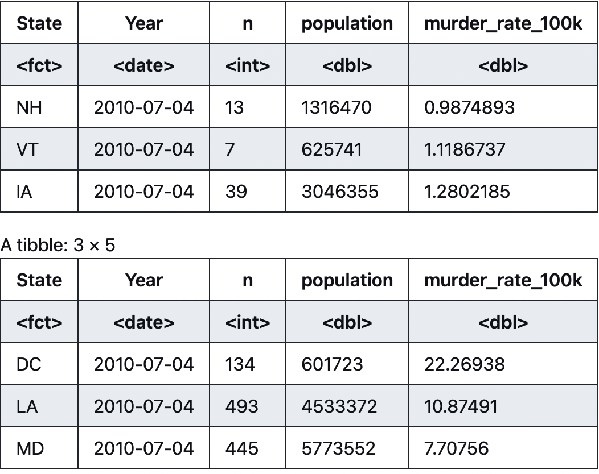

# Murder analysis in R

Murder analysis based on crime data and 
gun-freedom scores across the US. I was trying to find any correlations betweeen 
these two variables. But statistical analysis didn't show any 
potential correlations between them. I was using R language to 
import different types of files to import data, analyze it and visualize


## Skills applied

R, Data cleaning, Data preparation, Data importing, Visualization in R, Statistics


## Features

- ggplot
- fread
- correlation
- log scaling
- wrapping graphs 
- joining tables


## R code
```{r}
murder_rate_table %>%
filter(format(Year, format = "%Y") == "2010") %>%
arrange(murder_rate_100k) %>%
head(3)


murder_rate_table %>%
filter(format(Year, format = "%Y") == "2010") %>%
arrange(desc(murder_rate_100k)) %>%
head(3)
```





```{r}
cor(murder_vs_gun$Index, murder_vs_gun$murder_rate_100k)

#As we can see from the calculation and the graph, there's no correlation between gun freedom
#and murder rate
```
-0.327823087058607


## Screenshots


## Instructions 

To see the whole code go to Crime Data.md
    
